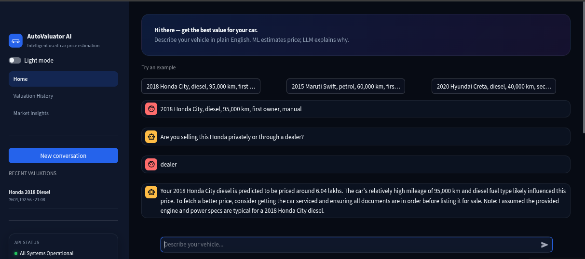
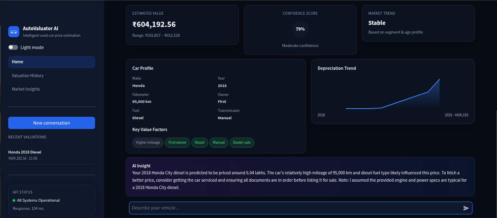

<div align="center">

# AutoValuator AI — Car Price Predictor

**Chat in plain English to get instant used-car valuations**  
Powered by scikit-learn ML + Groq LLM + FastAPI + Redis + Streamlit

[](https://car-price-predictor-bot.streamlit.app)
[](https://fastapi-car-price-api-i09k.onrender.com/docs)
[](https://github.com/Muskansuman/LLM-Powered-Car-Price-Prediction-Assistant)
[](https://fastapi-car-price-api-i09k.onrender.com/health)
[](https://www.python.org/)
[](https://fastapi.tiangolo.com/)
[](https://streamlit.io/)
[](https://www.docker.com/)
[](LICENSE)

**Try the chatbot:** [https://car-price-predictor-bot.streamlit.app](https://car-price-predictor-bot.streamlit.app)

</div>

---

## Live Links

| Service | URL | Description |
|---|---|---|
| **Chatbot (Streamlit)** | [car-price-predictor-bot.streamlit.app](https://car-price-predictor-bot.streamlit.app) | Main UI — ask for car prices in natural language |
| **API Docs (Swagger)** | [fastapi-car-price-api-i09k.onrender.com/docs](https://fastapi-car-price-api-i09k.onrender.com/docs) | Interactive REST API documentation |
| **Health Check** | [fastapi-car-price-api-i09k.onrender.com/health](https://fastapi-car-price-api-i09k.onrender.com/health) | Backend status (`{"status":"ok"}`) |
| **GitHub** | [github.com/Muskansuman/LLM-Powered-Car-Price-Prediction-Assistant](https://github.com/Muskansuman/LLM-Powered-Car-Price-Prediction-Assistant) | Source code |

> **Note:** The API runs on Render's free tier. The first request after idle time may take 30–60 seconds to wake up.

---

## Demo

Try it live: [car-price-predictor-bot.streamlit.app](https://car-price-predictor-bot.streamlit.app)

### Chat conversation



### Valuation dashboard



**Sample conversation:**

```
You  →  2018 Honda City, diesel, 95,000 km, first owner, manual

Bot  →  Are you selling this Honda privately or through a dealer?

You  →  dealer

Bot  →  Your 2018 Honda City diesel is predicted to be worth around ₹6.04 lakhs.
         Higher km for its age and diesel fuel type influenced the estimate.
         Getting the car serviced and keeping documents ready can help at resale.
```

---

## How It Works

```
User text
    │
    ▼
LLM (Groq)                    ← extracts structured car features from free text
    │
    ▼
RandomForest ML model         ← predicts price from extracted features
    │
    ▼
LLM (Groq)                    ← explains price in friendly natural language
    │
    ▼
Streamlit UI (Car Price Predictor)   ← chat + valuation dashboard
```

**Redis** stores conversation history per session so follow-up questions work without repeating car details.

---

## Features

- **Conversational ML** — type naturally; the LLM extracts features, the model predicts, the LLM explains
- **Multi-turn memory** — Redis-backed chat history for follow-ups
- **Smart field inference** — technical specs (engine cc, bhp, torque, seats) auto-filled from car model
- **Modern Streamlit UI** — dark/light theme, valuation cards, depreciation chart, API status
- **Production patterns** — API key auth, rate limiting, Prometheus metrics, Docker Compose stack
- **Swappable LLM** — Groq (default), Google Gemini, or Ollama via env var

---

## Architecture

```
┌──────────────┐   text   ┌──────────────────┐   features  ┌────────────┐
│ Car Price    │────────► │  FastAPI /chat   │────────────►│  ML model  │
│  Predictor   │          │  extractor +     │             │ (sklearn)  │
└──────────────┘          │  explainer       │             └────────────┘
                          └────────┬─────────┘                  │
                                   │                             ▼
                                   ▼                        ┌─────────┐
                          LLM (Groq / Gemini / Ollama)       │  Redis  │
                                                               └─────────┘
```

---

## Quickstart (Docker)

```bash
git clone https://github.com/Muskansuman/LLM-Powered-Car-Price-Prediction-Assistant.git
cd LLM-Powered-Car-Price-Prediction-Assistant

cp .env.example .env
# Add GROQ_API_KEY from https://console.groq.com

docker compose up --build
```

| Service | URL |
|---|---|
| Chat UI | http://localhost:8501 |
| API Swagger | http://localhost:8001/docs |
| Prometheus | http://localhost:9090 |
| Grafana | http://localhost:3000 |

---

## Quickstart (Local)

```bash
python3 -m venv venv && source venv/bin/activate
pip install -r requirements.txt

docker run -d --name redis -p 6379:6379 redis:alpine
cp .env.example .env   # add GROQ_API_KEY

uvicorn app.main:app --host 0.0.0.0 --port 8000 --reload
# separate terminal:
streamlit run frontend/chat_app.py
```

Local Streamlit secrets (`.streamlit/secrets.toml`):

```toml
[api]
base_url = "http://127.0.0.1:8000"
api_key = "demo-key"
```

---

## API Reference

| Method | Endpoint | Auth | Description |
|---|---|---|---|
| `POST` | `/login` | — | Get JWT token |
| `POST` | `/predict` | api-key + JWT | Predict from structured JSON |
| `POST` | `/chat` | api-key | Chat in natural language |
| `DELETE` | `/chat/{session_id}` | api-key | Reset a chat session |
| `GET` | `/health` | — | Health check |
| `GET` | `/metrics` | — | Prometheus metrics |
| `GET` | `/docs` | — | Swagger UI |

### Example `/chat` request

```bash
curl -X POST https://fastapi-car-price-api-i09k.onrender.com/chat \
  -H "Content-Type: application/json" \
  -H "api-key: demo-key" \
  -d '{"message": "2018 Honda City, diesel, 95000 km, first owner, manual"}'
```

---

## Tech Stack

| Layer | Tool |
|---|---|
| API | FastAPI, Uvicorn |
| ML | scikit-learn (RandomForest) |
| LLM | Groq (llama-3.3-70b-versatile) |
| Memory & cache | Redis |
| Frontend | Streamlit |
| Monitoring | Prometheus + Grafana |
| Deploy | Render (API) + Streamlit Cloud (UI) |

---

## Project Structure

```
app/
├── api/              # /login, /predict, /chat
├── llm/              # extractor, explainer, providers
├── memory/           # Redis conversation history
├── models/           # trained model.joblib
└── services/         # inference
frontend/
└── chat_app.py       # Car Price Predictor Streamlit UI
training/             # model training pipeline
data/                 # car-details.csv
```

---

## Deploy

### API → [Render](https://render.com)

1. **New → Blueprint** → select this repo (`render.yaml`)
2. Set env vars: `GROQ_API_KEY`, `API_KEY`
3. Live URL: `https://fastapi-car-price-api-i09k.onrender.com`

### UI → [Streamlit Cloud](https://share.streamlit.io)

1. **New app** → repo → main file: `frontend/chat_app.py`
2. Add `runtime.txt` at repo root: `python-3.11`
3. **Secrets**:

```toml
[api]
base_url = "https://fastapi-car-price-api-i09k.onrender.com"
api_key = "demo-key"
```

4. Custom URL example: `car-price-predictor-bot` → `https://car-price-predictor-bot.streamlit.app`

---

## Author

**Muskan Suman**

[](https://www.linkedin.com/in/muskansuman29/)
[](mailto:muskan.suman2907@gmail.com)
[](https://github.com/Muskansuman/LLM-Powered-Car-Price-Prediction-Assistant)
